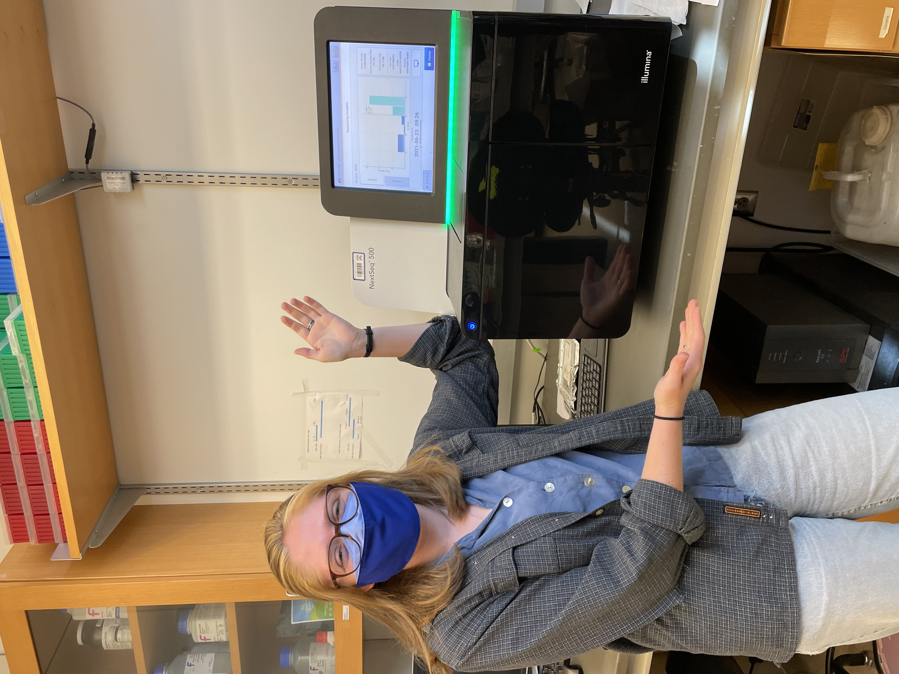

##### Hi, I'm Catherine Lucey, and welcome to my website! 

I am a first year PhD student in Environmental Health Sciences at the Columbia University Mailman School of Public Health. Previously, I worked as a Next Generation Sequencing lab tech at the University of Pennsylvania, and I completed my BA in Biochemistry at Vassar College. You can learn more about me [here](about.html).

